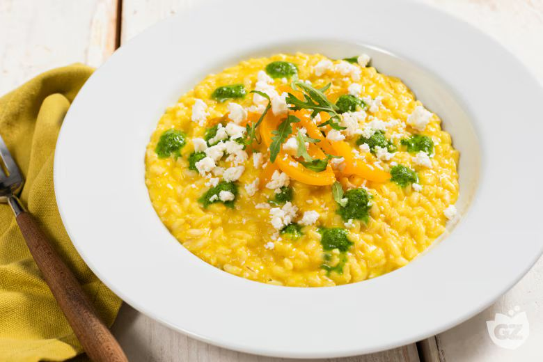

# Risotto con peperoni e rucola

{{hi:Peperone}}
{{hi:Rucola}}

## Ingredienti

| Ingredienti                  | Ingredienti             |
| ---------------------------- | ----------------------- |
| **320 g** - Riso Carnaroli | **40 g** - Vino bianco |
| **80 g** - Quartirolo lombardo | Olio evo |
| **400 g** - Acqua | Sale |

**Salsa ai peperoni**

| Ingredienti                  | Ingredienti             |
| ---------------------------- | ----------------------- |
| **600 g** - Peperoni gialli | Olio evo |
| **1** - Cipolla dorata | Sale |
| Acqua | |

**Salsa alla rucola**

| Ingredienti                  | Ingredienti             |
| ---------------------------- | ----------------------- |
| **50 g** - Rucola | **25 g** - Olio evo |
| **20 g** - Acqua | Sale |

## Procedimento

1. Per preparare il risotto con peperoni e rucola, come prima cosa pulite i peperoni: eliminate le estremità, i semi e i filamenti interni, poi tagliateli a striscioline.
1. Tagliate la cipolla a julienne e mettetela in una padella con un filo d’olio e un pizzico di sale. Cuocete a fuoco medio per 10 minuti, mescolando frequentemente. Aggiungete quindi i peperoni e saltate per altri 10 minuti.
1. Prelevate qualche strisciolina di peperone che servirà per la decorazione finale. Trasferite il tutto in un mixer, aggiungete dell’acqua e frullate fino ad ottenere una salsa liscia e omogenea. Tenete da parte in caldo.
1. Adesso occupatevi della salsa alla rucola: in un mixer mettete la rucola (conservate qualche fogliolina per la decorazione), aggiungete l’olio, l’acqua, un pizzico di sale e frullate. Il risultato sarà una salsa liscia e omogenea. Tenete da parte.
1. In una pentola versate un filo d’olio, aggiungete il riso e fate tostare per circa 7 minuti. Sfumate con vino bianco e, una volta evaporata tutta la parte alcolica, bagnate con 2 mestoli di acqua bollente.
1. Aggiustate di sale e, quando mancheranno 5 minuti alla fine della cottura, aggiungete la salsa di peperoni calda. Quando mancheranno 2 minuti alla fine della cottura del riso, spegnete il fuoco e insaporite con il pepe.
1. Mantecate con l’olio, 60 g di quartirolo sbriciolato e mescolate bene.
1. Impiattate e disponete sulla superficie del risotto delle gocce di salsa di rucola, i filetti di peperone tenuti da parte, il rimanente quartirolo e le foglioline di rucola fresca.

