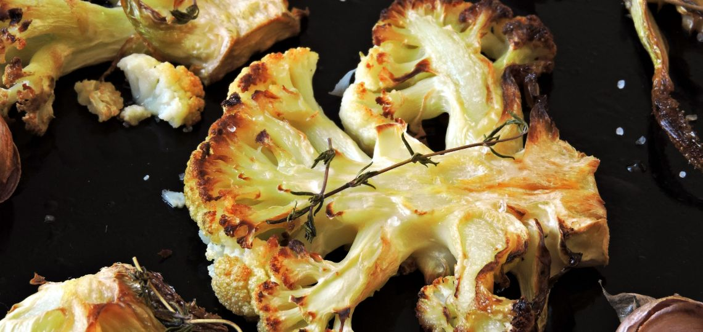

# Roast di cavolfiore

{{hi:Cavlofiore}}

## Ingredienti

| Ingredienti                  | Ingredienti             |
| ---------------------------- | ----------------------- |
| **220 g** - Cavolfiore | Sale e pepe |
| **35 g** - Burro ghee | |

## Procedimento

> Preriscaldare il forno a 200°

1. Spunta e taglia il cavolfiore in piccole cimette, considera che più piccole sono, più velocemente saranno pronte.
1. Metti le cimette di cavolfiore in una teglia da forno di idonee dimensioni. Aggiungi sale e pepe a piacere.
1. Ricopri i fiori di cavolfiori con delle fette sottili di burro ghee.
1. Dopodiché, inforna sulla griglia superiore del forno e cuoci facendo arrostire per circa 20 minuti o anche più, a seconda delle dimensioni delle cimette.
1. Estrai dal forno, lascia intiepidire e gusta!

