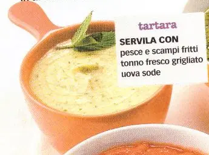

# Salsa Tartara

{{hi:Capperi}}

## Ingredienti

| Ingredienti                  | Ingredienti             |
| ---------------------------- | ----------------------- |
| **200 g** - Maionese | **1 ciuffo** - Prezzemolo |
| **1 cucchiaio** - Capperi | Qualche stelo di erba cipollina |
| **2-3** - Cetrioli in agrodolce | |

## Procedimento

1. Tritare i capperi, i cetrioli e le spezie
2. Mescolare alla maionese
