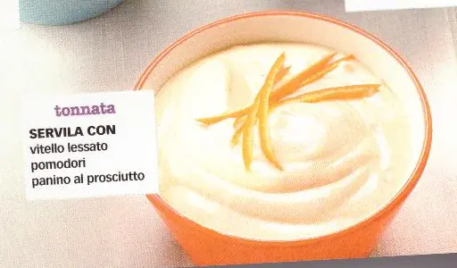

# Salsa tonnata

{{hi:Tonno}}

## Ingredienti

| Ingredienti                  | Ingredienti             |
| ---------------------------- | ----------------------- |
| **250 g** - Maionese | **20 g** - Capperi |
| **80 g** - Tonno sottolio sgocciolato | Succo di limone o di arancia |
| **2 filetti** - Acciuga | |

## Procedimento

1. Frullare assieme tutti gli ingredienti
2. Si può condire con succo di limone o di arancia
3. Si può guarnire con scorza di limone o arancia
