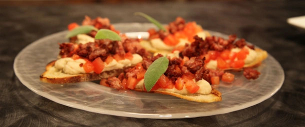

# Salsicce e fagioli all'uccelletto

{{hi:Pomodoro}}
{{hi:Salsiccia}}
{{hi:Fagioli}}

## Ingredienti

| Ingredienti                  | Ingredienti             |
| ---------------------------- | ----------------------- |
| **4** - Salsicce  | Olio evo |
| **500 g** - Fagioli cannellini, già cotti ma non sfatti | Sale |
| **500 g** - Pomodori ramati già concassè tagliati a dadini | pepe |
| **1 spicchio** - Aglio | Crostini di pane |
| **1 rametto** - Salvia |  |

## Procedimento

1. Mettete a soffriggere i fagioli in olio d'oliva con l'aglio. 
1. Nel frattempo sbriciolate le salsicce, mettetele a cuocere in padella senza aggiungere nulla e lasciatele rosolare nel proprio grasso fino a quando non fanno la crosticina. 
1. Togliete i fagioli dal fuoco e metteteli nel frullatore con l'olio, il sale, un pò d'acqua e del pepe. 
1. Impiattate con i crostini di pane ricoperti di crema di fagioli, concassè di pomodori e salsiccia. 
1. Guarnite con foglioline di salvia.
