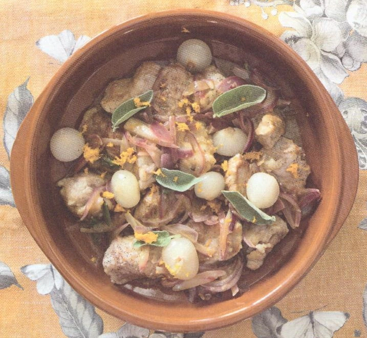

# Spezzatino di vitello con cipolline in agrodolce e scorze d'arancia

{{hi:Vitello}}
{{hi:Cipolline in agrodolce}}

## Ingredienti

| Ingredienti                  | Ingredienti             |
| ---------------------------- | ----------------------- |
| **600 g** - Spezzatino di vitello | Olio evo |
| **2** - Arance | **1 noce** - Burro |
| **1 vasetto** - Cipolline in agrodolce | **q.b.** - Farina |
| **2** - Cipolle rosse | Erbe aromatiche |

## Procedimento

1. In una casseruola ampia, aggiungere olio e burro, inserire la carne precedentemente passata nella farina, rosolare bene in modo da rendere i bocconcini ben dorati su tutti i lati.
1. Togliere dalla casseruola, aggiungere in pentola le cipolle tagliate a julienne e il succo d'arancia, far ammorbidire le cipolle e inserire nuovamente lo spezzatino. Regolare di sale e pepe, aggiungere erbe aromatiche a piacimento, cuocere per 25 minuti.
1. Una volta che la carne risulterà cotta, aggiungere la buccia di arancia precedentemente grattugiata e le cipolline in agrodolce. Cuocere per altri 5/6 minuti.
