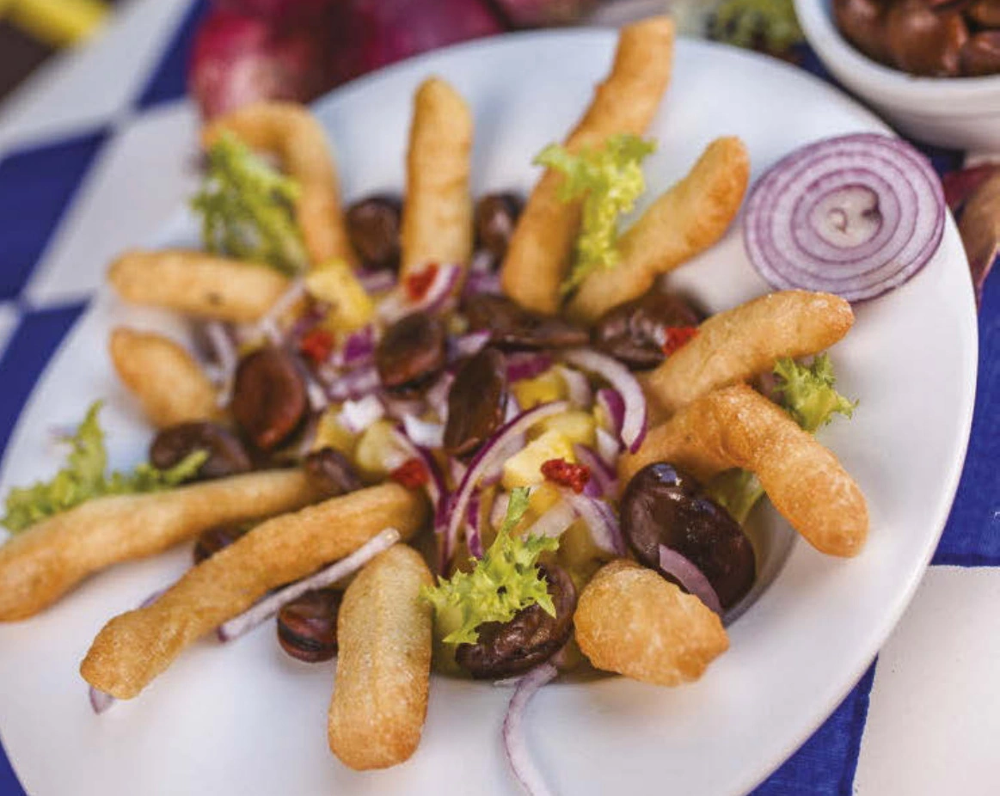

# Straccetti fritti

{{hi:Cipolla}}
{{hi:Fave}}
{{hi:'Nduja}}

## Ingredienti

| Ingredienti                  | Ingredienti             |
| ---------------------------- | ----------------------- |
| **1 panetto** - Impasto per pizza | 'Nduja |
| **1** - Cipolla rossa di Tropea | Olio di semi |
| Scarola riccia (qualche foglia) | Olio evo |
| Fave gia' lessate | Sale |

## Procedimento

1. Stendete il panetto di pizza a uno spessore di circa 1 cm e, aiutandovi con una rotella, ritagliate tanti bastoncini lunghi. Fate scaldare abbondante olio di semi in una padella capiente, quindi tuffate i bastoncini di pizza e friggeteli, girandoli di tanto in tanto.
1. Quando saranno leggermente dorati e croccanti, scolateli e fateli asciugare su carta assorbente da cucina. Conditeli con un pizzico di sale.
1. Sbucciate la cipolla e tagliatela a fettine sottili. Disponetele in un piatto da portata e adagiate sopra gli straccetti di pizza. Guarnite a piacere con le fave lessate, qualche fogliolina di scarola riccia e la ‘nduja a tocchetti. Condite il tutto con un filo di olio a crudo e servite.
