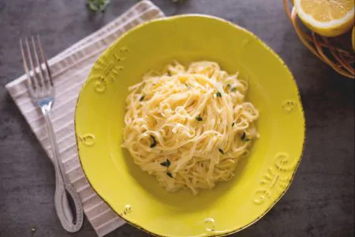

# Tagliolini al limone

{{hi:Limone}}

## Ingredienti

| Ingredienti                  | Ingredienti             |
| ---------------------------- | ----------------------- |
| **350 g** - Tagliolini | Succo di limone  |
| **40 g** - Burro| **10 g** - Olio evo |
| **125 g** - Panna da cucina (o ricotta)| Timo |
| Scorza di limone | Sale |

## Procedimento

1. Lavate bene il limone e grattugiate la scorza, facendo attenzione a evitare la parte bianca, di sapore amarognolo; poi spremete il succo del limone. Prendete un tegame capiente o una padella larga dai bordi alti, aggiungete l’olio, il burro e la scorza di limone e fate sciogliere il tutto a fuoco molto dolce.
1. Unite anche il succo di limone (potete filtrarlo per evitare che i semini finiscano nel condimento) e la panna. Lessate i tagliolini in acqua bollente salata finché pronti al dente, poi scolateli e aggiungeteli direttamente alla padella col condimento.
1. Fate saltare velocemente il tutto, aggiungendo un mestolo di acqua di cottura della pasta se necessario e mescolando per amalgamare bene. Aggiungete qualche fogliolina di timo e spegnete il fuoco. I vostri tagliolini al limone sono pronti per essere serviti ben caldi!
