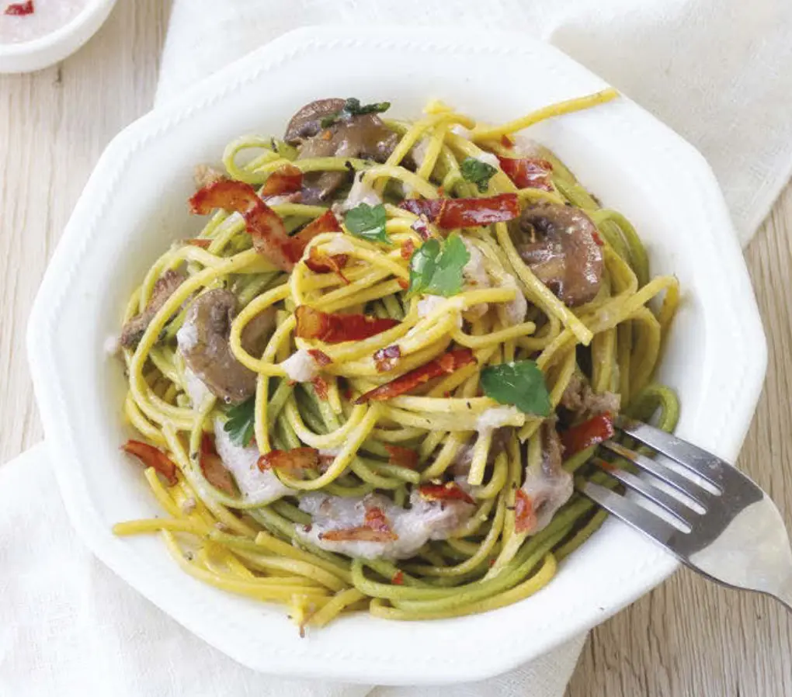

# Tagliolini paglia e fieno con champignon e speck

{{hi:Champignon}}
{{hi:Funghi}}
{{hi:Speck}}

## Ingredienti

Pasta:

| Ingredienti                  | Ingredienti             |
| ---------------------------- | ----------------------- |
| **350 g** - farina di grano duro macinata a pietra | **** -  |
| **50 g** - spinaci in polvere | **4** - uova |

Sugo:

| Ingredienti                  | Ingredienti             |
| ---------------------------- | ----------------------- |
| **200 g** - speck a listerelle | **1** - Spicchio d'aglio |
| **300 g** - champignon già puliti | **1** - Ciuffo di prezzemolo |
| **\\( \frac{1}{2} \\) bicchiere** - Vino bianco | Olio evo |
| **\\( \frac{1}{2} \\)** - Cipolla | Sale e pepe |

## Procedimento

1. Preparate la pasta di colore verde: disponete 150 g di farina a fontana su una spianatoia, unite al centro 2 uova e la polvere di spinaci e impastate energicamente fino a ottenere un panetto liscio e omogeneo; avvolgetelo in un foglio di pellicola trasparente e lasciate riposare per mezz’ora a temperatura ambiente.
1. Preparate la pasta di colore bianco: disponete 200 g di farina a fontana su una spianatoia, unite al centro 2 uova e impastate energicamente fino a ottenere un panetto liscio e omogeneo; avvolgetelo in un foglio di pellicola trasparente e lasciate riposare per mezz’ora a temperatura ambiente.
1. Trascorso il tempo di riposo, stendete i due impasti e ricavate delle sfoglie sottili. Arrotolatele e con un coltello affilato tagliatele alla larghezza di 2-3 mm. Allargate i tagliolini su un canovaccio infarinato e lasciateli asciugare.
1. Per il condimento: tritate la cipolla e fatela appassire in una padella con un filo di olio e lo spicchio di aglio; aggiungete i funghi, tagliati a fettine, e fate rosolare per qualche minuto. Bagnate con il vino e lasciate sfumare, quindi proseguite la cottura per 10-15 minuti.
1. Frullate la metà dello speck in un mixer da cucina con un goccio di acqua, fino a ottenere una cremina omogenea. Versatela in padella con i funghi e mescolate per bene. In un’altra padella fate cuocere lo speck restante finché non sarà ben croccante.
1. Lessate la pasta in acqua bollente e leggermente salata, quindi scolatela al dente, versatela in padella con i funghi e la crema di speck e mantecate per bene. Impiattate, cospargete con lo speck croccante e il prezzemolo tritato e servite.
