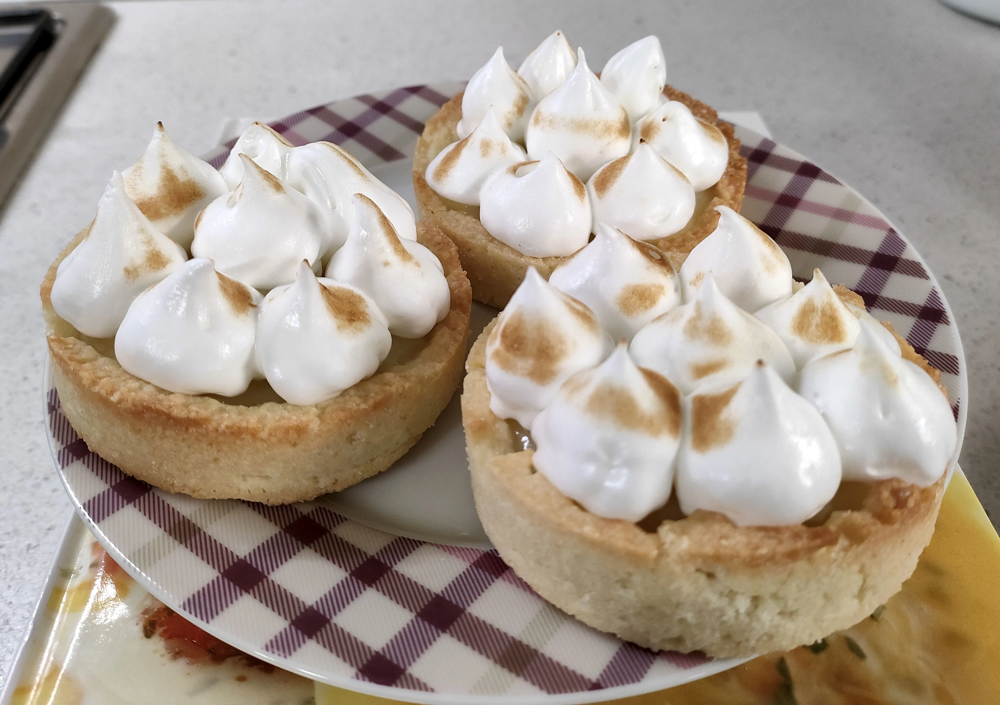

# Tartellette con crema al limone

{{hi:Limone}}

## Ingredienti

### Per la pasta frolla

| Ingredienti                  | Ingredienti             |
| ---------------------------- | ----------------------- |
| **250 g** - Farina 00 | Scorza di limone |
| **150 g** - Burro | **2** - Tuorli |
| **100 g** - Zucchero | |

### Per la crema al limone

| Ingredienti                  | Ingredienti             |
| ---------------------------- | ----------------------- |
| **75 ml** - Succo di limone | Scorza di limone |
| **100 g** - Zucchero | **1** - Uovo |
| **100 g** - Burro | |

### Per la meringa all’ italiana

| Ingredienti                  | Ingredienti             |
| ---------------------------- | ----------------------- |
| **2** - Albumi | **25 ml** - Acqua |
| **100 g** - Zucchero | |

## Procedimento

### Pasta frolla

> Preriscaldare il forno a 170°C

1. In una planetaria munita di foglia lavora il burro leggermente morbido con lo zucchero e la scorza di limone, una volta che lo zucchero e il burro si saranno completamente amalgamati, aggiungi i tuorli uno alla volta. Una volta amalgamate le uova aggiungi la farina.
2. Ora che l’impasto sta prendendo forma trasferiscilo su una spianatoia leggermente infarinata e impasta molto velocemente.
3. Forma un panetto, copri con pellicola alimentare e lascia riposare in frigorifero per almeno 30 minuti.
4. Trascorso il tempo di riposo, recupera la pasta frolla e con l’aiuto di due fogli da carta forno stendila dello spessore di circa 1 cm, con un coppa pasta ricava dei dischi riponili in uno stampo da muffin precedentemente imburrato e infarinato.
5. Ricava delle strisce di carta forno con il quale coprirai la pasta frolla e su di essa aggiungerai delle sfere o dei ceci secchi, per far si che in cottura non si gonfi la pasta frolla.
6. Inforna a 170° in modalità statica per circa 20 minuti.
7. Una volta pronti lascia completamente raffreddare.

### Crema al limone

1. In un pentolino porta a bollore il succo di limone con parte dello zucchero, il burro e la scorza di limone.
2. In una ciotola sbatti l’uovo con il restante zucchero, Una volta raggiunto il bollore travasa il liquido ottenuto nella ciotola con l’uovo, amalgama e trasferisci la crema di nuovo nel pentolino e finisci la cottura a fuoco dolce, la crema sarà pronta quando inizierà a sobbollire.
3. Trasferisci in un ciotola la salsa ottenuta e lasciala raffreddare con pellicola a contatto.

### Meringa all'italiana

1. In una planetaria munita di frusta, lavora gli albumi d’uovo con parte dello zucchero
2. In un pentolino aggiungi l’acqua e il restante zucchero e riponi sul fuoco a fiamma dolce, con l’aiuto di un termometro da cucina fai arrivare lo sciroppo alla temperatura 121° (una cosa molto importante non mescolare mai lo sciroppo), dopodichè aggiungi a filo lo sciroppo agli albumi e continua a montare per almeno altri 5 minuti.
3. Quando il composto risulterà lucido e bello compatto, trasferiscilo in una sac a poche munito di bocchetta stellata.
4. Riprendi i cestini di pasta frolla, ormai completamente raffreddati e disponi sopra la crema al limone anche lei ormai raffreddata.
5. Con la sac a poche crea dei ciuffetti di meringa sopra, con un cannello vai a caramellare le tue tartellette.