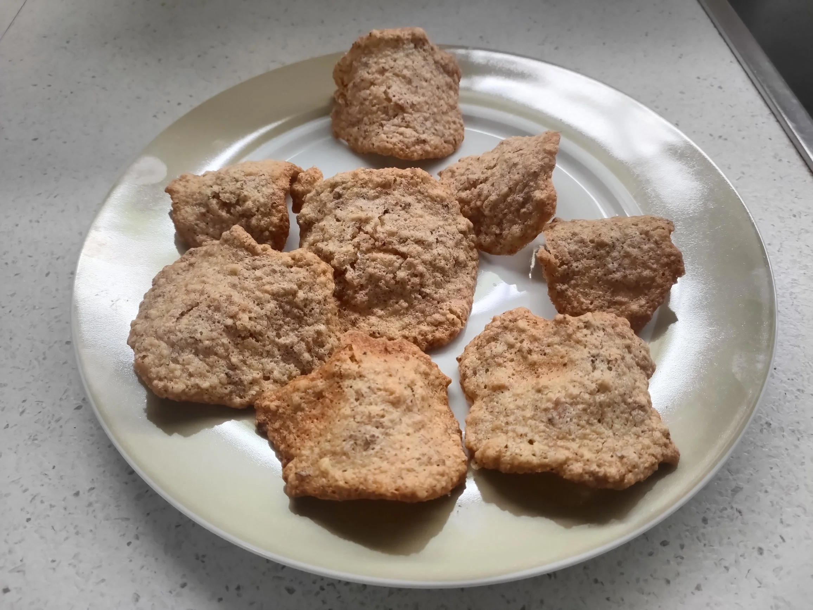

# Tegole dolci valdostane

## Ingredienti

| Ingredienti                  | Ingredienti             |
| ---------------------------- | ----------------------- |
| **80 g** - Nocciole | **60 g** - Burro |
| **80 g** - Mandorle | **4** - Albumi |
| **200 g** - Zucchero | **1** - Baccello di vaniglia |
| **60 g** - Farina 00 | |

## Procedimento

Preriscaldare il forno a 150

1. Iniziate tostando le mandorle e le nocciole: rivestite una leccarda con carta da forno e disponeteci sopra le mandorle e le nocciole 1. Cuocete in forno statico preriscaldato a 150° per 30 minuti
1. Trascorso questo tempo, lasciate intiepidire il tutto e poi spellate le mandorle e le nocciole con le mani.
1. Trasferite la frutta secca tostata in un mixer assieme a metà della dose totale di zucchero. Azionate per qualche secondo, fino a ridurre il tutto in briciole.
1. Trasferite la farina di noci e mandorle in una ciotola capiente e aggiungete il burro che avete fatto sciogliere in precedenza, mescolate fino a compattare, aiutandovi con una spatola. 
1. Aggiungete i semini della vaniglia, versate la farina in un colino e setacciatele direttamente nella ciotola contenente il composto, mescolate bene e mettete da parte.
1. Ora ponete gli albumi in una ciotola e montateli con uno sbattitore elettrico. Non appena inizieranno a montarsi, aggiungete l'altra metà dose di zucchero e continuate, fino a che non otterrete un composto gonfio e spumoso. 
1. Unite gli albumi montati al composto e mescolate con una spatola per amalgamare e ottenere un composto omogeneo.
1. Rivestite nuovamente una leccarda con carta da forno e ponete con un cucchiaio piccole quantità di impasto di circa 10 g a 3-4 cm di distanza le une dalle altre. Schiacciate ogni goccia di impasto con il dorso di un cucchiaio, formando dei cerchi del diametro di circa 7 cm e sottili \\(\frac{1}{2}\\) millimetro. Per facilitarvi  nell'operazione, bagnate il dorso del cucchiaio, in modo che l'impasto non aderisca troppo alla superficie.
1. Completata quest'operazione, cuocete in forno statico preriscaldato a 180° per 8 minuti. 
1. Quando risulteranno leggermente croccanti e brunite, sfornatele e adagiatele su un mattarello, in questo modo si seccheranno e acquisiranno la loro tipica forma incurvata.
