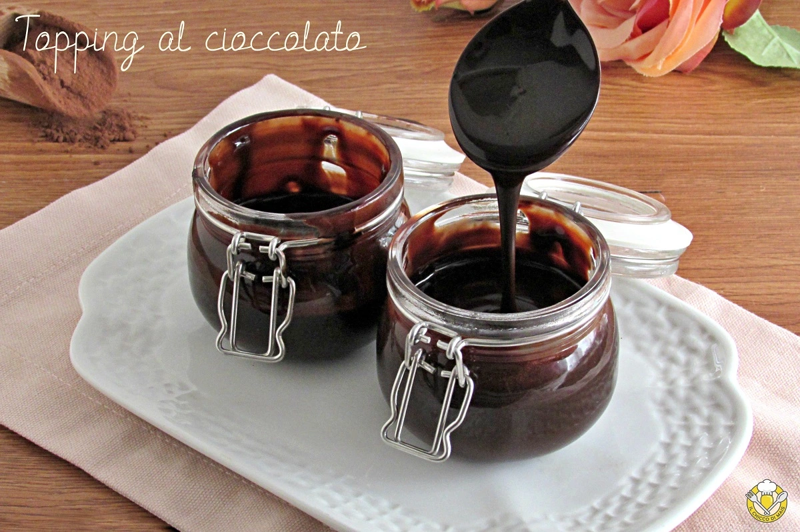

# Topping al cioccolato

{{hi:Cacao}}

## Ingredienti

| Ingredienti                  | Ingredienti             |
| ---------------------------- | ----------------------- |
| **150 ml** - Acqua | **1 pizzico** - Sale |
| **120 g** - Zucchero | **3 gocce** - Aroma alla vaniglia |
| **50 g** - Cacao amaro in polvere | |

## Procedimento

1. Per preparare il topping al cioccolato iniziate mettendo in una ciotola il cacao amaro, lo zucchero, un pizzico di sale e l’aroma di vaniglia.
2. Mescolateli bene con un cucchiaio o con una frusta a mano, quindi unite l’acqua fredda poco a poco, mescolando sempre fino a unirla tutta. Non vi preoccupate se rimane qualche piccolo grumo, si scioglierà quando andrete a mescolare il topping al cioccolato sul fuoco.
3. Trasferite il composto in un tegame dal fondo spesso e mettetelo sul fuoco basso. Mescolate con un cucchiaio finché lo zucchero non si sarà sciolto e non saranno più presenti grumi. 
4. Portate il composto a ebollizione e, dal momento in cui inizia a bollire, lasciatelo cuocere per due minuti, mescolando sempre. 
5. Spegnete il fuoco. Il topping al cioccolato sarà ancora un pochino liquido, ma raffreddandosi assumerà la giusta consistenza, fluida ma densa.
6. Una volta freddo, potete usare il topping al cioccolato per guarnire dolci e gelati.
