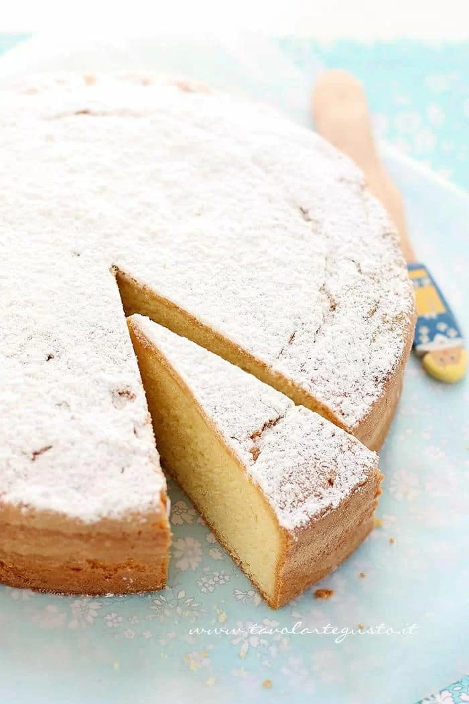
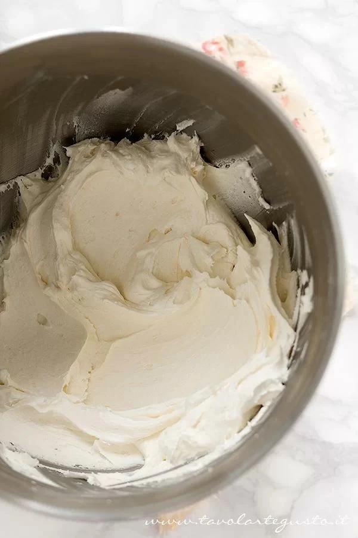
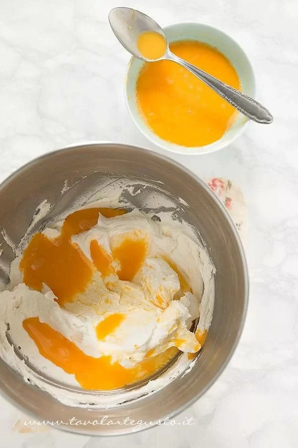
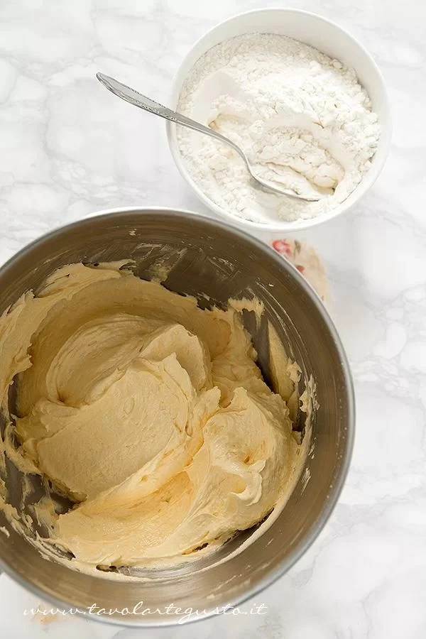
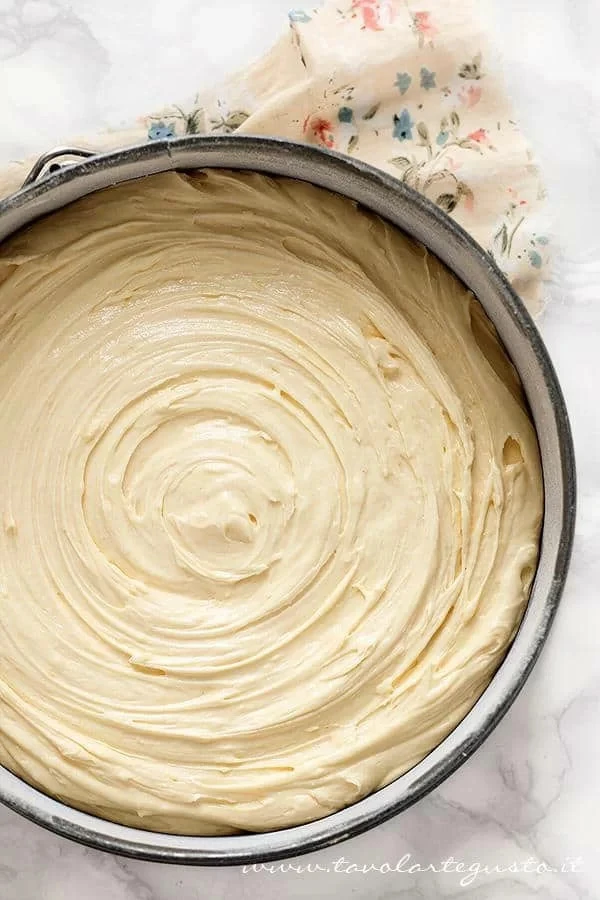

# Torta Paradiso

## Ingredienti

| Ingredienti                  | Ingredienti             |
| ---------------------------- | ----------------------- |
| **130 g** - Farina 00 | **2** - Uova |
| **130 g** - Fecola di patate | Buccia grattugiata di limone |
| **200 g** - Burro morbido | **3 g** - Lievito per dolci |
| **250 g** - Zucchero a velo (non vanigliato) | **2 pizzichi** - Sale |
| **5** - Tuorli grandi | |

## Procedimento

> Preriscaldare il forno a 175°

1. Montate burro, zucchero e buccia grattugiata del limone (precedentemente lavato e asciugato, da cui avrete ricavato solo la polpa gialla, evitando di grattugiare il bianco) con l'aiuto di fruste elettriche.

    Questa fase di "montaggio" è il punto di partenza e il segreto per la perfetta riuscita della vostra torta. Impiegherete circa 20-25 minuti per ottenere un composto cremoso, soffice e montato come panna.

    Non fermatevi al primo risultato ottenuto dopo qualche minuto, quando la massa sembra montata ma non lo è.  

    Il burro deve assumere un colore chiaro, chiarissimo, innevato. Dovente sentirlo liscio, "pannoso" , leggero, perfettamente amalgamato allo zucchero a velo e per questo ci vorrà un pochino di pazienza:

1. Una volta ottenuto un composto cremoso e pannoso, aggiungete le uova e i tuorli a temperatura ambiente, precedentemente pesati e sbattuti leggermente con la forchetta. Aggiungete poche uova alla volta, a filo sul composto

    Amalgamate a velocità bassa e costante e aggiungete ancora un po' di composto d'uovo, solo quando le precedenti sono perfettamente assorbite.

    Ripetete l'operazione montando a velocità bassa - moderata fino ad esaurimento uova.  

    Il composto finale, come vedete dalla foto più in basso, si deve presentarsi soffice, cremoso e leggero proprio come la montata precedente di burro e zucchero, solo naturalmente “colorato” di giallo intenso grazie alla presenza delle uova.

1. A questo punto aggiungete le farine: fecola, farina e lievito precedentemente setacciate insieme un paio di volte, insieme al sale.

    Aggiungete anche le farine a piccole dosi (1 cucchiaio alla volta) aspettate il completo assorbimento del primo cucchiaio per poi aggiungere il secondo. Amalgamate sempre a velocità bassa - moderata fino ad ottenere un composto cremoso e soffice.

1. Imburrate una teglia e infarinatela leggermente, adagiatevi il composto, avendo cura di distribuirlo perfettamente nello stampo, avendo cura di ottenere una superficie liscia  e abbastanza omogenea

1. Cuocete in forno preriscaldato statico a \unit[175]{\textcelsius} per circa 40 minuti. Non aprite il forno prima di 30 minuti, cioè fino a quando non si è formata una superficie solida. La cottura potrebbe anticiparsi di qualche minuto, quindi la torta potrebbe essere pronta a 30-35 minuti oppure posticiparsi fino a 45 minuti, a seconda del forno che state utilizzando. Fate sempre la prova con uno stuzzicadenti che deve uscire completamente asciutto.

1. Spolverate di zucchero a velo

## Note

Di solito questo tipo di dolci, tende a formare un piccolo un rigonfiamento al centro. Come risolvere il problema?

Sfornate la torta e ancora calda sformatela capovolgendola su un piatto da portata largo e piatto. Lasciatela in questo modo per 15 minuti circa. non di più altrimenti si forma la condensa nel piatto (umidità) a questo punto ri-capovolgetela di nuovo con l'ausilio di un piatto, un tagliere piatto e adagiatela su una gratella a raffredderarsi.
