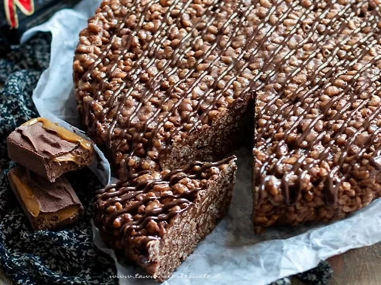

# Torta al mars

{{hi:Mars}}

## Ingredienti

| Ingredienti                  | Ingredienti             |
| ---------------------------- | ----------------------- |
| **500 g** - Mars | **120 g** - Riso soffiato |
| **120 g** - Burro | **50 g** - Cioccolato al latte o fondente per decorare |

## Procedimento

1. Prima di tutto sciogliete in una padella molto capiente i mars con il burro a fuoco lento. Girate con un cucchiaio fino ad ottenere un composto uniforme. Unite il riso soffiato.
1. Girate bene, affinchè tutto il riso soffiato sia ben condito con la salsa al cioccolato e caramello. Versate il composto in una teglia, precedentemente foderata di carta da forno. Appiattite bene la superficie e battete un paio di volte sul tavolo, in modo che non si formino vuoti.
1. Trasferite la torta in frigo per almeno 1 h. Sformate con tutta la carta da forno e decorate con cioccolato fuso freddo.
