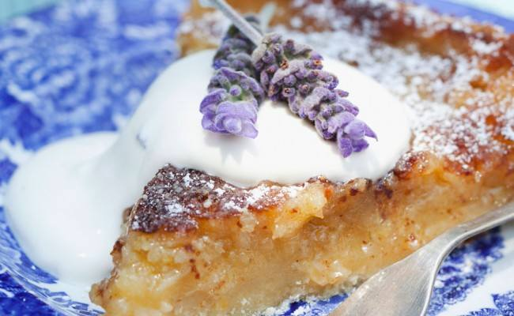

# Torta alla lavanda

{{hi:Mele}}
{{hi:Lavanda}}

## Ingredienti

| Ingredienti                  | Ingredienti             |
| ---------------------------- | ----------------------- |
| **180 g** - Burro | **2 cucchiai** - Latte |
| **2** - Mele | **120 g** - Zucchero |
| **4** - Uova | **1 bustina** - Vanillina |
| **280 g** - Farina | **3 cucchiaini** - Fiori di lavanda essiccati |
| **1 bustina** - Lievito per dolci | |

## Procedimento

> Preriscaldare il forno a 180°

1. Sciogliete il burro a bagnomaria, poi unite i fuori di lavanda essiccati e lasciate in infusione per 10/15 minuti. 
2. Nel frattempo, in una terrina sbattete le uova con lo zucchero fino ad ottenere un composto spumoso.
3. Setacciate farina, lievito e vanillina e aggiungeteli a pioggia al composto di uova e zucchero, continuando a mescolare bene. 
4. Sbucciate le mele, eliminate il torsolo e tagliatele a pezzetti piccoli, aggiungeteli all’impasto e mescolate dopo aver aggiunto il latte. 
5. Filtrate il burro dalla lavanda e unitelo al composto insieme ad un altro cucchiaino di fiori di lavanda.
6. Imburrate e infarinate la tortiera, versate l’impasto e infornate a 180°C per 40 minuti. 
7. Fate raffreddare la torta alla lavanda, poi tagliatela e se siete dei veri golosi, accompagnatela con la panna montata. 

