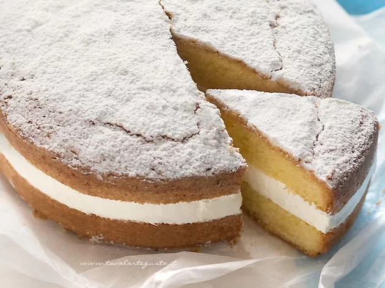

# Torta kinder Paradiso

## Ingredienti

| Ingredienti                  | Ingredienti             |
| ---------------------------- | ----------------------- |
| Torta paradiso  | Crema al latte |

## Procedimento

1. Si parte con una [torta paradiso](Torta-Paradiso.md).
1. La Torta va tagliata e farcita solo quando è completamente fredda altrimenti si sbriciola!  

    Un trucchetto per fare un taglio perfetto è porre il coltello a lama lunga (con il quale dovrete effettuare il taglio) in frigo o in freezer e tagliare la base quando questo è freddissimo.
2. Farcite la vostra Torta Kinder Paradiso con [crema al latte](Crema-al-latte.md). Adagiando la farcitura sulla base della torta. Create uno spessore di farcia di circa 1-1,5 cm
3. Adagiate dolcemente sulla crema l'altro disco di torta paradiso 
4. Infine spolverate con abbondante zucchero a velo!
