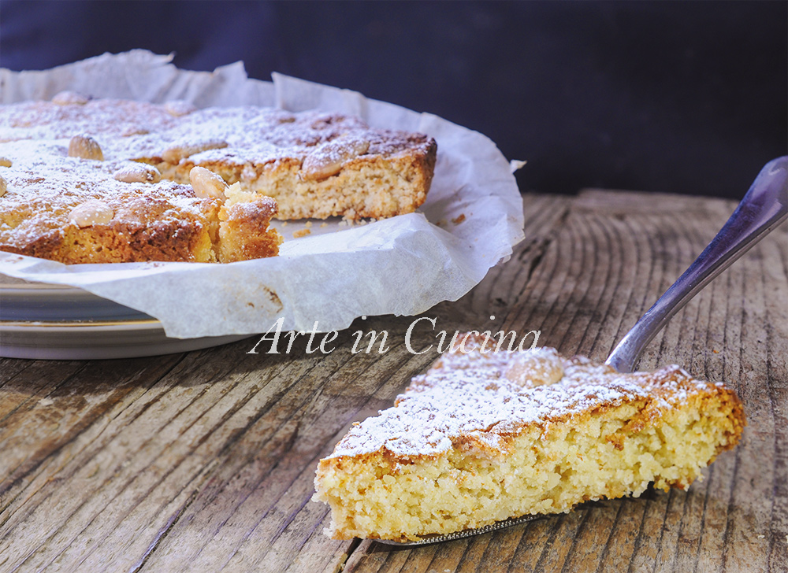

# Torta mandorle e miele (torta principessa)

{{hi:Mandorle}}
{{hi:Miele}}

## Ingredienti

| Ingredienti                  | Ingredienti             |
| ---------------------------- | ----------------------- |
| **220 g** - Farina per dolci | **\\(\frac{1}{2}\\) bicchiere** - Latte tiepido |
| **70 g** - Zucchero | **\\(\frac{1}{2}\\) bustina** - Lievito per dolci |
| **60 g** - Miele | **50 g** - Burro |
| **60 g** - Mandorle pelate (più quelle per la decorazione) | **15 g** - Scorza d'arancia candita |

## Procedimento

> Preriscaldare il forno a 180°

1. Sciogliete il lievito nel latte.
1. Tritate le mandorle nel frullatore.
1. Mescolate la farina con il latte e il burro fuso, aggiungete lo zucchero, il miele, buccia di arancia grattugiata o canditi e le mandorle.
1. Lavorate fino ad ottenere un composto corposo.
1. Versate il composto sulla spianatoia, lavoratelo un po' con le mani poi sistematelo in una tortiera, da 20 cm, imburrata ed infarinata o rivestita con carta forno.
1. Decorate con le mandorle, infornate per circa 25 minuti, a 180° controllate il vostro forno.
1. Sfornate fate intiepidire, spolverate di zucchero a velo.
