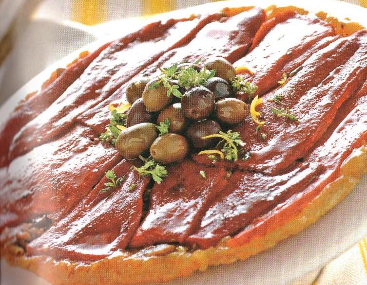

# Torta rovesciata di peperoni e olive

{{hi:Peperone}}
{{hi:Olive taggiasche}}
{{hi:Pecorino romano}}

## Ingredienti

| Ingredienti                  | Ingredienti             |
| ---------------------------- | ----------------------- |
| **2** - Peperoni rossi | **240 g** - Pasta sfoglia fresca già stesa |
| **100 g** - Olive taggiasche | **30 g** - Burro |
| **40 g** - Pecorino romano grattuggiato | **10 g** - Zucchero |
| **4 filetti** - Acciuga sott'olio | Sale |
| **1 mazzetto** - Timo | |

## Procedimento

1. Spella i peperoni. 
1. Fai arrostire i peperoni in forno già caldo a 220° per circa 35-40 minuti, girandoli spesso, finché la pelle tendera a staccarsi.
1. Trasferiscili in una pentola, metti il coperchio e lasciali intiepidire. Spellali, dividili in falde ed elimina il picciolo e tutti i semi.
1. Prepara gli altri ingredienti. Schiaccia le olive con la lama di un grosso coltello, snocciolale, tritale grossolanamente e mescolale con le acciughe sgocciolate e spezzettate, il pecorino grattugiato, le foglie di 2 rametti di timo e 1 pizzico di sale.
1. Sciogli il burro nella teglia, unisci lo zucchero e fallo caramellare. Togli la teglia dal fuoco e disponi sul fondo i peperoni. 
1. Fai intiepidire, copri i peperoni con il trito di olive e pecorino e completa disponendoci sopra la pasta sfoglia tagliata a misura. 
1. Spingi i bordi della pasta verso il fondo dello stampo, bucherellala con una forchetta e cuoci in forno gia caldo a 220 °C per circa 25 minuti. 
1. Lascia riposare la tatin per quaiche minuto, rovesciala su un piatto da portata, guarmniscila con olive e timo e servila tiepida o fredda
