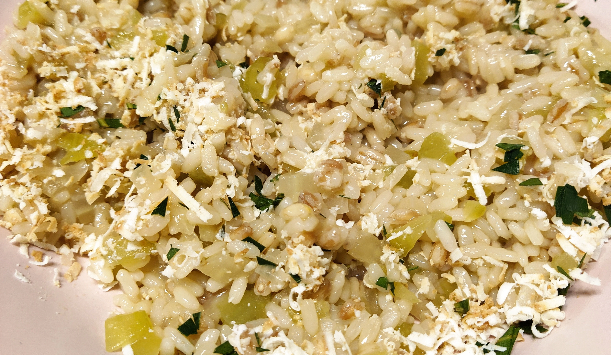

# Zuppa rustica ai tre cereali

{{hi:Farro}}
{{hi:Riso}}
{{hi:Orzo}}
{{hi:Ricotta affumicata}}

## Ingredienti

| Ingredienti                  | Ingredienti             |
| ---------------------------- | ----------------------- |
| **200 g** - Cereali misti (farro, riso, orzo) | **2 cucchiai** - Ricotta affumicata |
| **1** - Cipolla | **1 l** - Brodo vegetale |
| **8 fette** - Pane casereccio | **3 cucchiai** - Olio evo |
| **1 costa** - Sedano | Timo, alloro, peperoncino |
| **1 cuore** - Finocchio | Sale e pepe |

## Procedimento

1. Riducete a dadini la cipolla, il sedano e il finocchio e rosolateli nell'olio caldo. 
1. Aggiungete qualche foglia di timo, il brodo vegetale e bollite per qualche minuto
1. Unitevi il misto di cereali, sale e pepe e proseguite la cottura per altri 20 minuti circa. 
1. Tostate le fette di pane.
1. Servite la zuppa calda con il pane tostato, condite con la ricotta grattugiata, un pizzico di alloro fresco tritato e di peperoncino.
