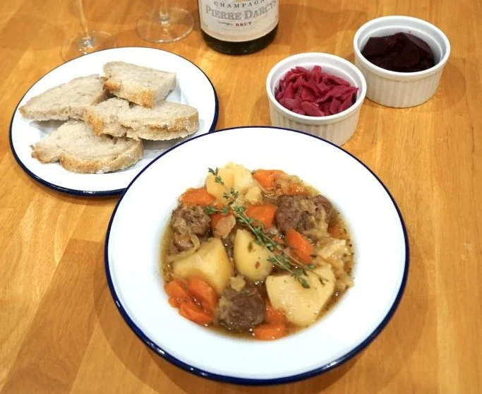

# Scouse

## Andy cooks

<iframe width="315" height="560"
src="https://www.youtube.com/embed/V_R6W62o7-U"
title="YouTube video player"
frameborder="0"
allow="accelerometer; autoplay; clipboard-write; encrypted-media; gyroscope; picture-in-picture; web-share"
allowfullscreen></iframe>

### Ingredienti

| Ingredienti                  | Ingredienti             |
| ---------------------------- | ----------------------- |
| **800 g** - 800g diced beef (I used rump, chuck is probably better)  | **3** - Potatoes, diced |
| **2** - Bay leaves | **1 bottle** - Bitter beer |
| **4 sprigs** - Thyme | **1 l** - Beef stock |
| **2** - Onions, dices | **3 tbsp** - Grapeseed oil |
| **2** - Swede, diced (rapa svedese) | Salt and pepper |
| **3** - Carrots, diced | |

### Procedimento

1. Start by heating the oil in a large pot you have the lid for. Once it’s hot, add the beef and season with salt. 
2. As soon as you have good colour on the beef, add the onions and cook for 3-4 minutes or until they just start to change colour. 
3. Add the bitter beer and reduce by 1/2. 
4. Add the rest of the veg, stir well and season with salt. 
5. Pour in the beef stock and bring to a simmer. 
6. Cook with the lid on for 2 hours. 
7. After 2 hours, remove the lid and cook for a further hour or until the beef is fork-tender. 
8. Serve with buttered bread and pickled red cabbage.

## Authentic pan of Scouse

[Sorgente](https://scousemrdarcycooks.com/recipes/authentic-pan-of-scouse-to-celebrate-global-scouse-day/)

### Ingredienti

| Ingredienti                  | Ingredienti             |
| ---------------------------- | ----------------------- |
| **1 kg** - Boneless lamb shoulder cut into large chunks or the same amount of chuck steak/stewing steak/braising steak | Salt and pepper |
| **300 g** Carote (5) - | Vegetable oil |
| **1** - Cipolla grande | **500 ml** - Beer |
| **1 kg** - Patate (King Edward and Maris Piper) | Crusty loaf to serve |
| Small bunch Fresh (or 1 tsp dried parsley) for amounts see note in the main post | beetroot to serve |
| **3 stalks** - fresh thyme (or **½ tsp** dried thyme) | pickled red cabbage to serve |
| **1 l** - Water approximately – depends on the size of your pan | |

### Procedimento

1. Cut the meat into large chunks if it isn’t already.
2. Peel the vegetables. Slice the carrots, cut the potatoes into large chunks and slice the onions.
3. Optional: I brown the meat and onions in a little vegetable oil prior to putting in the pressure cooker, but you don’t have to do this.
4. If you are using a pressure cooker: 
   1. Put the meat, onions, carrots, herbs, salt and pepper, ½ litre water and 250 ml of beer in the pressure cooker and pressurise for 20 minutes.
   2. Allow the pan to de-pressurise, then when it is safe to do so, add the potatoes, the remaining 250 ml beer and another ½ litre of water, or enough liquid to cover everything.
   3. Pressure cook for another 20 minutes. The meat should be falling apart and tender whilst the chunks of Maris Pipers should retain their shape. The King Edwards should be falling apart. You can help them on their way by crushing some of them with the back of a wooden spoon and then stirring in the resultant mush, if you want a thicker stew.
5. If you wish to cook on top of the stove: 
   1. Just throw everything into your pan, bring to the boil and then simmer very gently until the meat is tender, probably for at least an hour or it could take 2 hours or more.
   2. You need to add enough liquid to just cover the meat and vegetables, so you may need to adjust the quantity of liquid depending on the size of your pan.
6. If you are cooking in the oven:
   1. Again it will probably take at least an hour until the meat is tender, cooking at Gas 4, 180 °C, 350°F.
7. Serve with beetroot, pickled red cabbage and crusty bread. And beverage of your choice.
